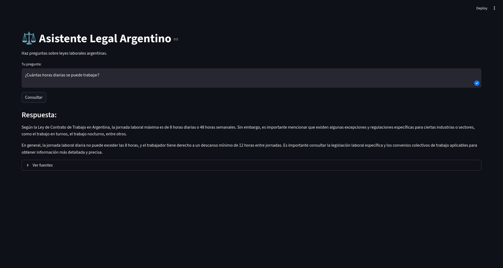

[](https://www.python.org/)
[](https://fastapi.tiangolo.com/)
[](https://streamlit.io/)
[](https://github.com/LexLuthorPrimero/legal-rag-chatbot/actions/workflows/ci.yml)
[](https://opensource.org/licenses/MIT)

# Legal RAG Chatbot

Sistema de preguntas y respuestas sobre leyes laborales argentinas usando Retrieval-Augmented Generation (RAG).

## Arquitectura

- **Ingesta**: documentos → chunking → embeddings (FastEmbed) → Pinecone (vector DB)
- **Consulta**: pregunta → embedding → búsqueda en Pinecone → contexto + LLM (Groq Llama 3) → respuesta
- **API**: FastAPI (endpoint `/ask`)
- **Frontend**: Streamlit

## Demo


[Ver demostración del chatbot funcionando](https://youtu.be/M4lLOUbNJiQ)

## Características

- Extracción de documentos desde archivos `.txt`
- Embeddings locales con FastEmbed
- Almacenamiento vectorial en Pinecone
- Generación de respuestas con Groq (`llama-3.3-70b-versatile`)
- API autodocumentada (OpenAPI)
- Interfaz de usuario con Streamlit
- Tests unitarios + CI (GitHub Actions)
- Pre-commit hooks (ruff, mypy)

## Instalación y uso

```bash
git clone https://github.com/LexLuthorPrimero/legal-rag-chatbot.git
cd legal-rag-chatbot
python -m venv venv
source venv/bin/activate
pip install -e .

# (Opcional) cargar documentos en Pinecone
python scripts/run_ingestion.py

# Ejecutar API
python scripts/run_api_local.py

# En otra terminal, ejecutar frontend
streamlit run src/frontend/app.py


Accede a http://localhost:8501 y prueba preguntas como:

    "¿Cuántas horas diarias se puede trabajar?"

    "¿Qué dice la ley sobre horas extra?"

Estructura
text

legal-rag-chatbot/
├── src/
│   ├── api/              # FastAPI
│   ├── frontend/         # Streamlit
│   ├── ingestion/        # carga, chunking, embeddings
│   └── utils/            # config, logging
├── tests/
├── scripts/
├── data/raw/leyes/
├── .github/workflows/
├── requirements.txt
├── pyproject.toml
└── README.md

Tests
bash

pytest tests/ -v --cov=src

Licencia

MIT
Autor

Lucas (LexLuthorPrimero)
GitHub | LinkedIn